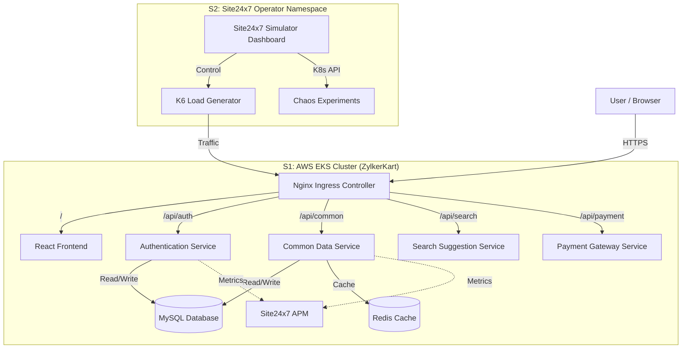

# ZylkerKart E-Commerce Full-Stack Microservice Application

## 1. Comprehensive Overview

ZylkerKart is a modern, cloud-native e-commerce platform designed to demonstrate a robust full-stack microservice architecture. It handles core e-commerce functionalities such as user authentication, product browsing (with search and suggestions), and payment processing.

The application is built with a focus on observability and scalability, integrating **Site24x7 Fullstack Observability** for observability monitoring. It is containerized using Docker and orchestrated via Kubernetes (AWS EKS), featuring a clear separation of concerns between the frontend, backend services, and data persistence layers. This project serves as a reference implementation for deploying polyglot microservices (Java and Python) on a production-grade Kubernetes cluster.

## 2. Microservice Architecture

The architecture consists of a React-based Single Page Application (SPA) interacting with multiple backend microservices through a unified Ingress Gateway. The backend consists of both Java (Spring Boot) and Python (FastAPI) services, backed by MySQL and Redis data stores.

### High-Level Architecture Diagram



### Component Details

1.  **React Frontend (`react-ui`)**:
    *   **Role**: The user interface for browsing products, logging in, and making purchases.
    *   **Communication**: Makes REST API calls to backend services via the Ingress path-based routing.

2.  **Authentication Service (`authentication-service`)**:
    *   **Role**: Manages user registration and login.
    *   **Key Feature**: Issues JWT (JSON Web Tokens) for secure access.
    *   **Data**: Persists user credentials in the MySQL database.

3.  **Common Data Service (`common-data-service`)**:
    *   **Role**: The core catalog service managing product data.
    *   **Performance**: Utilizes **Redis** for caching frequently accessed data to ensure low-latency responses.
    *   **Data**: Persists product information in MySQL.
    *   **Observability**: Instrumented with Site24x7 APM Insight Java Agent.

4.  **Search Suggestion Service (`search-suggestion-service`)**:
    *   **Role**: specialized service for handling product search queries and auto-suggestions.
    *   **Logic**: Likely optimized for fuzzy search or quick lookups.

5.  **Payment Gateway Service (`payment-gateway-service`)**:
    *   **Role**: Simulates payment processing.
    *   **Implementation**: A lightweight Python service using FastAPI.
    *   **Function**: Accepts payment requests and returns mock transaction receipts.

6.  **Site24x7 Simulator (`site24x7-sim`)**:
    *   **Role**: A Chaos Engineering and Traffic Simulation dashboard.
    *   **Functionality**:
        *   **Chaos Engineering**: Can kill pods, inject CPU/Memory pressure, and stress nodes.
        *   **Control Plane**: Acts as a UI/proxy to control the Load Generator.
        *   **Tech**: Python (FastAPI) interacting with the Kubernetes API.

7.  **Load Generator (`k6-loadgen`)**:
    *   **Role**: Generates synthetic user traffic to stress test the application.
    *   **Implementation**: **k6** (Grafana k6).
    *   **Scenarios**:
        *   `visitor_flow`: Browsing home and product pages (50-150 concurrent users).
        *   `shopper_flow`: Adding items to cart and checking out.
        *   `searcher_flow`: Performing search queries.
        *   `error_flow`: Intentionally triggering errors.

## 3. Tech Stack

### Frontend & Client
*   **Framework**: React.js (Single Page Application)
*   **Server**: Node.js (for serving/tooling)
*   **Styling**: Vanilla CSS / Bootstrap (inferred from common patterns)

### Backend Services
*   **Java Services** (Auth, Common Data, Search):
    *   **Language**: Java 11
    *   **Framework**: Spring Boot 2.3.x
    *   **Build Tool**: Maven
    *   **Libraries**: Spring Data JPA, Spring Security, Lombok, ModelMapper.
*   **Python Service** (Payment, Simulator):
    *   **Language**: Python 3.x
    *   **Framework**: FastAPI
    *   **Server**: Uvicorn

### Data Layer
*   **Relational Database**: MySQL 5.7/8.0
*   **Caching**: Redis (Alpine image)

### Infrastructure & DevOps
*   **Containerization**: Docker (Multi-arch support: x86_64, ARM64)
*   **Orchestration**: Kubernetes (AWS EKS)
*   **Ingress**: Nginx Ingress Controller
*   **Cluster Management**: `eksctl`
*   **Monitoring**: Site24x7 FSO

---

## 4. Backend API Contracts

This section details the REST API endpoints exposed by the backend microservices.

### 4.1 Authentication Service
**Base Path**: `/api/auth` (Mapped via Ingress)

| Method | Endpoint | Description | Request Body | Response |
| :--- | :--- | :--- | :--- | :--- |
| `POST` | `/authenticate` | Login & Get JWT | `{"username": "...", "password": "..."}` | JWT Token & User Info |
| `POST` | `/signup` | Create Account | `AccountCreationRequest` (fname, lname, email, user, pass) | Success/Failure Message |
| `GET` | `/test` | Health Check | None | "success" |

### 4.2 Common Data Service
**Base Path**: `/api/common` (Mapped via Ingress)

| Method | Endpoint | Query Params | Description |
| :--- | :--- | :--- | :--- |
| `GET` | `/products` | `q=<category_query>` | Get list of products filtered by category (e.g., `q=category:electronics`). |
| `GET` | `/products` | `product_id=<id>` | Get detailed information for a specific product ID. |
| `GET` | `/home` | None | Get data structure for the Home Screen (banners, deals). |
| `GET` | `/tabs` | None | Get data for Home Page Tabs (e.g., "New Arrivals"). |
| `GET` | `/filter` | `q=<filter_query>` | Get available filter attributes for products. |
| `GET` | `/search-suggestion-list` | None | Get a full list of keywords for search caching. |

### 4.3 Search Suggestion Service
**Base Path**: `/api/search` (Mapped via Ingress)

| Method | Endpoint | Query Params | Description |
| :--- | :--- | :--- | :--- |
| `GET` | `/search-suggestion` | `q=<keyword>` | Get real-time autocomplete suggestions for a keyword. |
| `GET` | `/default-search-suggestion` | None | Get default suggestions when search bar is focused but empty. |

### 4.4 Payment Gateway Service
**Base Path**: `/api/payment` (Mapped via Ingress)

| Method | Endpoint | Description | Request Body | Response |
| :--- | :--- | :--- | :--- | :--- |
| `POST` | `/payment` | Process Payment | JSON Payment Details | Payment Status & Receipt URL |
| `GET` | `/receipt` | View Receipt | None | HTML Page for the Receipt |

---

## 5. Site24x7 Simulator: How It Works

The **Site24x7 Simulator** (`site24x7-sim`) is a specialized control plane designed to test the resilience and performance of the ZylkerKart application. It operates separately from the main application namespace to ensure it remains accessible even if the app crashes.

### 5.1 Architecture & Process Flow

1.  **Dashboard UI**:
    The simulator provides a web-based dashboard (accessible via port-forward) where users can trigger Load Generation or Chaos Experiments.

2.  **The Scheduler Loop**:
    The core of the simulator is an asynchronous Python loop (`scheduler_loop` in `main.py`) that runs continuously in the background.
    *   **Check Experiments**: Every second, it iterates through the list of scheduled experiments.
    *   **Start Action**: If the current time matches an experiment's `start_time`, it marks it as `RUNNING` and executes the initial chaos action.
    *   **Stop Action**: When `end_time` is reached, it performs cleanup (e.g., deleting stress pods).

### 5.2 Failure Experiments

The simulator interacts directly with the Kubernetes API to inject failures.

*   **POD_KILL**:
    *   **Process**: Finds a random running pod matching the target label (e.g., `app=authentication-service`) and deletes it. Kubernetes will automatically recreate it, testing startup time and recovery.
    *   **Logic**: Uses `client.CoreV1Api().delete_namespaced_pod()`.

*   **POD_EVICTION**:
    *   **Process**: Forcefully evicts a pod with zero grace period, bypassing PodDisruptionBudgets for immediate termination.
    *   **Logic**: Uses `delete_namespaced_pod()` with `grace_period_seconds=0` and `propagation_policy='Foreground'`.

*   **OOM_KILL**:
    *   **Process**: Triggers an Out-of-Memory kill by spawning parallel memory-consuming processes inside the target pod.
    *   **Logic**: Uses `kubectl exec` to run 4 parallel `dd` commands writing to `/dev/shm` (2GB+ total allocation), causing the Linux OOM killer to terminate the container.
    *   **Result**: Pod shows `OOMKilled` status, container restart count increases.

*   **CrashLoopBackOff**:
    *   **Process**: Patches the target deployment's container command to `exit 1`, forcing the pod into a `CrashLoopBackOff` state.
    *   **Logic**: Uses `patch_namespaced_deployment` to modify the pod spec and later restores the original state.

*   **CPU/Memory/Disk Pressure (Pod Level)**:
    *   **Process**: Executes a command *inside* a running pod to consume resources.
    *   **Logic**: Uses `stream(v1.connect_get_namespaced_pod_exec, ...)` to run a shell command like `dd` (to consume RAM/Disk) or infinite loops (to consume CPU).

*   **Node Stress (CPU/Memory/Disk)**:
    *   **Process**: Schedules a "rogue" pod on a specific node to consume that node's resources (CPU, Memory, or Disk), affecting all pods on it.
    *   **Logic**: Creates a specific Pod with `nodeSelector` targeting the victim node and a container running resource-intensive commands.

### 5.3 Load Generator Control

The simulator acts as a proxy for the `k6-loadgen` service.
*   **User Action**: User clicks "Start Load" on the Simulator Dashboard.
*   **Proxy Request**: Simulator sends a POST request to `http://zylkerkart-loadgen` (ClusterIP service).
*   **K6 Execution**: The Load Generator pod receives the request and spawns VUs (Virtual Users) to hit the ZylkerKart public ingress endpoints.

---

## 6. EKS Deployment Instructions

This guide details the steps to deploy the ZylkerKart application to an Amazon EKS cluster.

### 6.1 Prerequisites

Ensure the following tools are installed and configured on your local machine:

1.  **AWS CLI**:
    *   Install: `brew install awscli` (macOS) or follow AWS docs.
    *   Configure: Run `aws configure` and set your `AWS Access Key ID`, `Secret Access Key`, `Region` (e.g., `us-east-1`), and `Output format` (json).
2.  **eksctl**:
    *   The official CLI for Amazon EKS.
    *   Install: `brew tap weaveworks/tap && brew install weaveworks/tap/eksctl`
3.  **kubectl**:
    *   The Kubernetes command-line tool.
    *   Install: `brew install kubectl`
4.  **Docker**:
    *   Required for building images. Ensure you have `buildx` enabled if building on Apple Silicon (M1/M2/M3) for x86 EKS nodes.

### 6.2 Cluster Configuration

We use a **3-node group** architecture to optimize costs and isolate workloads. This configuration is defined in `eks-cluster.yaml`.

| Node Group | Instance Type | Count | purpose | Scaling/Taints |
| :--- | :--- | :--- | :--- | :--- |
| **ng-services** | `t3.medium` | 2 | Application Microservices | General workloads |
| **ng-mysql** | `t3.small` | 1 | MySQL Database | Tainted: `dedicated=mysql:NoSchedule` |
| **ng-redis** | `t3.small` | 1 | Redis Cache | Tainted: `dedicated=redis:NoSchedule` |

**Why Taints?**
Taints ensure that only the database pods (which require stable performance) are scheduled on their dedicated nodes, preventing "noisy neighbor" issues from the application pods.

### 6.3 Deployment Process

#### Step 1: Create the EKS Cluster
Run the following command to provision the control plane and node groups. This will take approximately 15-20 minutes.

```bash
eksctl create cluster -f eks-cluster.yaml
```

#### Step 2: Configure Networking (Ingress)
We use the Nginx Ingress Controller to manage external access (Load Balancer) and routing.

```bash
# Deploy the Nginx Ingress Controller
kubectl apply -f https://raw.githubusercontent.com/kubernetes/ingress-nginx/controller-v1.8.2/deploy/static/provider/aws/deploy.yaml
```

#### Step 3: Build and Push Docker Images
*Note: If you are using pre-built images (e.g., `impazhani/zylkerkart-...`), you can skip this step.*
If you need to rebuild the images from source:

1.  **Authenticate Docker** with your registry (Docker Hub or ECR).
2.  **Build Multi-Arch Images**: Since EKS nodes are typically x86 (`linux/amd64`) and your local machine might be ARM64 (Mac M1), use `docker buildx`.

```bash
# Example: Build Payment Gateway
docker buildx build --platform linux/amd64,linux/arm64 \
  -t your-user/zylkerkart-payment-gateway-service:latest \
  -f server/payment-gateway-service/Dockerfile \
  --push server/payment-gateway-service
```

*Repeat for all services in `server/` directory.*

#### Step 4: Deploy the Application Stack
The `k8s/` directory contains all necessary manifests.

1.  **Create Namespace** (Optional, but recommended):
    ```bash
    kubectl create namespace zylkerkart
    ```

2.  **Apply All Manifests**:
    ```bash
    kubectl apply -f k8s/
    ```
    *This command deploys:*
    *   `mysql` and `redis` (Stateful inputs)
    *   `authentication-service`, `common-data-service`, `search-suggestion-service` (Java Apps)
    *   `payment-gateway-service` (Python App)
    *   `react-ui` (Frontend)
    *   `ingress` (Routing rules)
    *   This also applies the APM agent environment variables (requires Section 7 updates).

3.  **Verify Application**:
    Check if pods are running and verify the load balancer URL:
    ```bash
    kubectl get ingress -n zylkerkart
    ```

    open the <ALB_URL> is browser.

---

## 7. Site24x7 Monitoring Setup

This section outlines how to configure Site24x7 Fullstack Observability for the application.

### 7.1 APM Insight Configuration (Application Level)

Each backend microservice is pre-configured with the Site24x7 APM Insight agent. The license key is stored in a **Kubernetes Secret** to avoid committing sensitive credentials to git.

**Steps:**

1.  **Create the Kubernetes Secret**:
    Create a secret containing your Site24x7 License Key (this is NOT committed to git):
    ```bash
    kubectl create secret generic site24x7-apm-secret \
      --from-literal=license-key=<YOUR_SITE24X7_LICENSE_KEY> \
      -n zylkerkart
    ```
    *Replace `<YOUR_SITE24X7_LICENSE_KEY>` with your actual license key.*

2.  **Deploy the Services**:
    The following manifests are pre-configured to reference the secret:
    *   `k8s/common-data-service.yaml`
    *   `k8s/authentication-service.yaml`
    *   `k8s/search-suggestion-service.yaml`
    *   `k8s/payment-gateway-service.yaml`

    The secret reference in the YAML looks like:
    ```yaml
    env:
      - name: S247_LICENSE_KEY
        valueFrom:
          secretKeyRef:
            name: site24x7-apm-secret
            key: license-key
    ```

3.  **Apply Changes**:
    ```bash
    kubectl apply -f k8s/
    ```

4.  **Enable Monitors in Site24x7 Console**:
    After deployment, go to Site24x7 → APM → Java/Python → Applications and **enable** the monitors. The agents will show as "Managed" until activated.

### 7.2 Kubernetes Monitoring (Cluster Level)

To monitor the health and performance of the EKS cluster nodes and pods, deploy the Site24x7 Kubernetes Agent.

**Prerequisites**:
*   `site24x7-agent.yaml` file located in the project root.
*   Your Site24x7 Device Key (different from the APM License Key).

**Deployment Command:**
```bash
kubectl create secret generic site24x7-agent --from-literal KEY=<SITE24X7_KEY> && kubectl apply -f site24x7-agent.yaml
```

**Verification:**
```bash
kubectl get pods -n default -l app=site24x7-agent
```

---

## 8. Site24x7 Simulator Deployment

The simulator and load generator run in a separate namespace (`site24x7-operator`) to avoid interfering with the main application namespace.

#### Step 1: Deploy Simulator & Chaos Engine
```bash
kubectl apply -f k8s/site24x7-sim.yaml
```
*   Creates namespace `site24x7-operator`.
*   Deploys `site24x7-sim` pod with RBAC permissions to control other pods (for chaos experiments).

#### Step 2: Deploy Load Generator
```bash
kubectl apply -f k8s/load-generator.yaml
```
*   Deploys the `k6` load generator pod.

#### Step 3: Access Simulator Dashboard

Open `http://<ALB_URL>/site24x7` in your browser. From here, you can:
*   Start/Stop Load Generation.
*   Schedule Chaos Experiments (Pod Kill, CPU Stress, Memory Stress).

---

## 9. Troubleshooting

Common issues encountered during deployment and validation:

### 9.1 Pods & Deployment Issues
*   **CrashLoopBackOff (Exec format error)**:
    *   **Cause**: Attempting to run ARM64 (Apple Silicon) images on x86 EKS nodes.
    *   **Fix**: Rebuild docker images with `--platform linux/amd64` using `docker buildx`.
*   **Pending Pods**:
    *   **Cause**: Insufficient resources (CPU/Memory) or Node Affinity/Taints not met.
    *   **Fix**: Check `kubectl describe pod <pod-name> -n zylkerkart`. Ensure `ng-mysql` and `ng-redis` node groups are scaled up and have the correct taints.
*   **ImagePullBackOff**:
    *   **Cause**: Image not found in repository or permission denied.
    *   **Fix**: Verify image tag in YAML matches pushed tag. Ensure repo is public or K8s has `imagePullSecrets`.

### 9.2 Connectivity & Networking
*   **502 Bad Gateway (Ingress)**:
    *   **Cause**: Backend service is crashing or not reachable by Ingress Controller.
    *   **Fix**: Check logs of the specific service (e.g., `kubectl logs -n zylkerkart <pod>`).
*   **404 Not Found (Frontend/API)**:
    *   **Cause**: Ingress rewrite rules might be incorrect or path mismatch.
    *   **Fix**: Ensure `nginx.ingress.kubernetes.io/rewrite-target: /$2` annotation is present and paths match regex (e.g., `/api/common(/|$)(.*)`).

### 9.3 Database & State
*   **Database Connection Refused**:
    *   **Cause**: MySQL pod is not ready or Service name resolution failed.
    *   **Fix**: Verify `mysql-db` service exists in `zylkerkart` namespace. Check if `DB_HOST` env var matches service name.
*   **Data Lost After Pod Restart**:
    *   **Cause**: MySQL was running without persistent storage.
    *   **Fix**: MySQL now uses a `PersistentVolumeClaim` (10Gi EBS volume). Ensure the AWS EBS CSI driver is installed:
        ```bash
        eksctl create addon --name aws-ebs-csi-driver --cluster <CLUSTER_NAME>
        aws iam attach-role-policy --role-name <NODE_ROLE_NAME> \
          --policy-arn arn:aws:iam::aws:policy/service-role/AmazonEBSCSIDriverPolicy
        ```
*   **Tables Not Created (Hibernate)**:
    *   **Cause**: `SPRING_JPA_HIBERNATE_DDL_AUTO` not set to `create` or `update`.
    *   **Fix**: The `common-data-service` uses `ddl-auto=create` to auto-generate tables on startup.
*   **Redis Connection Errors**:
    *   **Cause**: Redis requires password but app not providing it, or vice versa.
    *   **Fix**: Check `REDIS_PASSWORD` env var in `common-data-service.yaml`.

### 9.4 Monitoring & Simulation
*   **Site24x7 APM Agent Not Reporting**:
    *   **Cause 1**: License key secret not created.
    *   **Fix**: Create the secret: `kubectl create secret generic site24x7-apm-secret --from-literal=license-key=<KEY> -n zylkerkart`
    *   **Cause 2**: Agent showing "911 - Manage the agent" in logs.
    *   **Fix**: Go to Site24x7 → APM → Applications and **enable/activate** the monitor.
    *   **Verify**: Check agent logs: `kubectl exec -n zylkerkart <pod> -- cat /home/apm/*/apminsight_agent_*.log | tail -20`
*   **Site24x7 Kubernetes Agent Not Reporting**:
    *   **Cause**: Invalid Device Key or Network firewall blocking outbound traffic.
    *   **Fix**: Check agent logs: `kubectl logs -n default -l app=site24x7-agent`.
*   **Simulator Dashboard Not Loading**:
    *   **Cause**: Port forwarding stopped or pod crashed.
    *   **Fix**: Re-run port-forward command. Check simulator logs for python errors.
